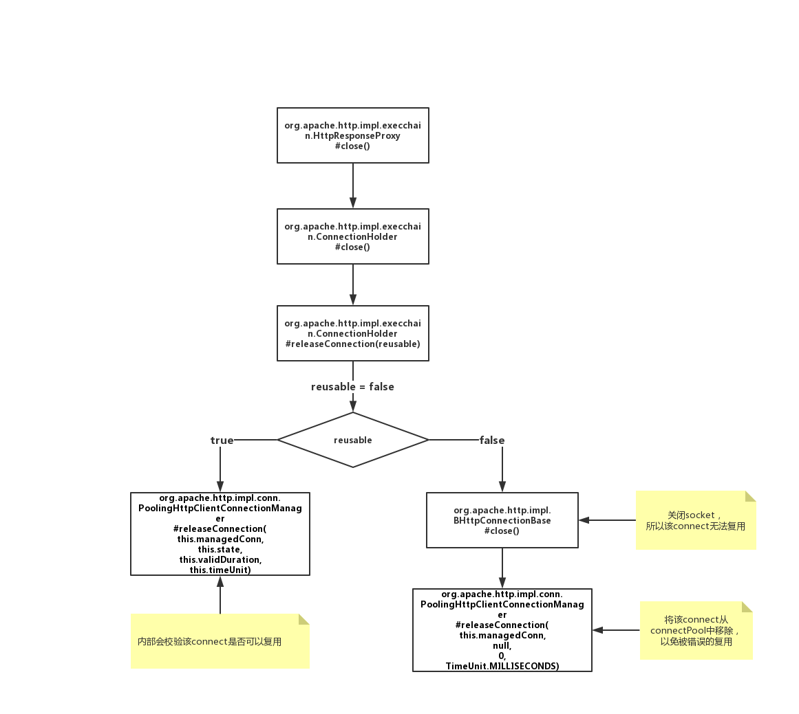
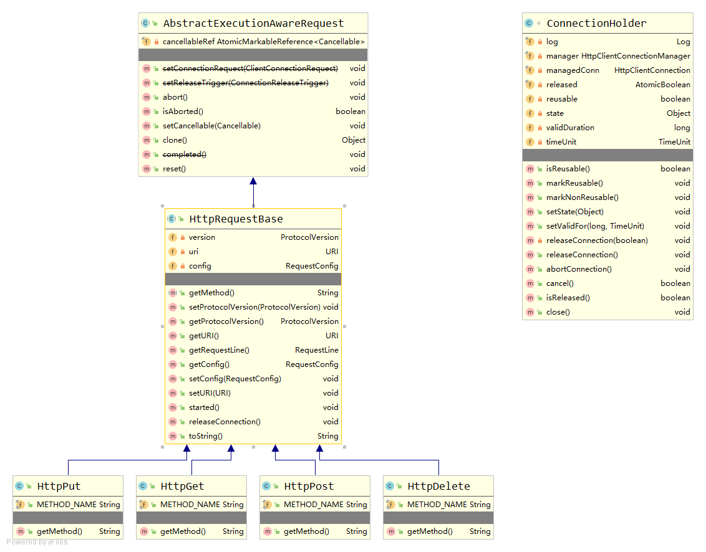

# apache-httpclient-examples

```
<dependency>
    <groupId>org.apache.httpcomponents</groupId>
    <artifactId>httpclient</artifactId>
    <version>4.5.10</version>
</dependency>
```

## 1. 待整理

## 2. close()、shutdown()、releaseConnection()


```JAVA

public class HttpCloseTest extends AbstractHttpClientTestng {
    
    public void example() throws IOException {
        HttpClient httpClient = null;
        HttpGet method = null;
        HttpResponse response = null;
        try {
            httpClient = HttpClients.createDefault();
            method = new HttpGet("http://www.baidu.com");
            response = httpClient.execute(method);
            // ...
        } catch (IOException e) {
            e.printStackTrace();
        }finally{
            ((CloseableHttpResponse) response).close(); 
            
            response.getEntity().getContent().close();
            
            method.releaseConnection();
            
            httpClient.close();
        }
    }
}
```

|                                             | is close connect/socket? | connect-pool status | remark |
| ------------------------------------------- | ------------------------ | ------------------- | ------ |
| ((CloseableHttpResponse) response).close()  | close                    | running             | BHttpConnectionBase#close();       |
| response.getEntity().getContent().close()   | reusable                 | running             | BHttpConnectionBase#close(); 如果本身connect不支持reusable，则会关闭connect/socket |
| method.releaseConnection()                  | close                    | running             | BHttpConnectionBase#shutdown();       |
| httpClient.close()                          | close                    | shutdown            | BHttpConnectionBase#close(); 如果其余connect还在工作中，会强制终止（不会等connect工作完成）       |

`BHttpConnectionBase` 中 `close()` 与 `shutdown()` 的区别（不一定正确的理解）：
1. `close()`相对温柔，会等到手上的事情做完再`socket.close()`。（不一定指 connect的全部数据包交互完毕） 

总结，业务代码中应该是调用`response.getEntity().getContent().close()`！

### 2.1 `((CloseableHttpResponse) response).close()` 与 `response.getEntity().getContent().close()`

1. `((CloseableHttpResponse) response).close()` 关闭连接，且连接不可复用。



```JAVA
package org.apache.http.impl.execchain;

class HttpResponseProxy implements CloseableHttpResponse {
    
    @Override
    public void close() throws IOException {
        if (this.connHolder != null) {
            this.connHolder.close();
        }
    }
}
```

```JAVA
package org.apache.http.impl.execchain;

class ConnectionHolder implements ConnectionReleaseTrigger, Cancellable, Closeable {
    
    @Override
    public void close() throws IOException {
        // vergilyn, 2019-12-16 >>>>  释放连接，false: 连接不可复用
        releaseConnection(false);
    }
    
    private void releaseConnection(final boolean reusable) {
        // vergilyn, 2019-12-16 >>>> 该连接未释放，则执行释放连接的操作；否则，什么都不做
        if (this.released.compareAndSet(false, true)) {
            
            /* vergilyn, 2019-12-16 >>>> 
             * reusable，true连接可复用；
             * manager，org.apache.http.impl.conn.PoolingHttpClientConnectionManager
             * managedConn，org.apache.http.impl.conn.CPoolProxy
             */
            synchronized (this.managedConn) {
                if (reusable) {
                    // vergilyn, 2019-12-16 >>>> 内部会再次检测 连接是否可复用，若可复用则放到conn-pool；否则关闭并移除该连接
                    this.manager.releaseConnection(this.managedConn,
                            this.state, this.validDuration, this.timeUnit);
                } else {
                    try {
                        // vergilyn, 2019-12-16 >>>> 关闭socket，org.apache.http.impl.BHttpConnectionBase.close
                        this.managedConn.close();
                        log.debug("Connection discarded");
                    } catch (final IOException ex) {
                        if (this.log.isDebugEnabled()) {
                            this.log.debug(ex.getMessage(), ex);
                        }
                    } finally {
                        this.manager.releaseConnection(
                                this.managedConn, null, 0, TimeUnit.MILLISECONDS);
                    }
                }
            }
        }
    }
}
```

```JAVA
package org.apache.http.impl;

public class BHttpConnectionBase implements HttpInetConnection {
    
    @Override
    public void shutdown() throws IOException {
        final Socket socket = this.socketHolder.getAndSet(null);
        if (socket != null) {
            // force abortive close (RST)
            try {
                socket.setSoLinger(true, 0);
            } catch (final IOException ex) {
            } finally {
                socket.close();
            }
        }
    }
    
    @Override
    public void close() throws IOException {
        final Socket socket = this.socketHolder.getAndSet(null);
        if (socket != null) {
            try {
                this.inBuffer.clear();
                this.outbuffer.flush();
                try {
                    try {
                        socket.shutdownOutput();
                    } catch (final IOException ignore) {
                    }
                    try {
                        socket.shutdownInput();
                    } catch (final IOException ignore) {
                    }
                } catch (final UnsupportedOperationException ignore) {
                    // if one isn't supported, the other one isn't either
                }
            } finally {
                socket.close();
            }
        }
    }
}
```
注意`close()`与`shutdown()`的区别！！！


```JAVA
package org.apache.http.impl.conn;

public class PoolingHttpClientConnectionManager
    implements HttpClientConnectionManager, ConnPoolControl<HttpRoute>, Closeable {
    
    @Override
    public void releaseConnection(
            final HttpClientConnection managedConn,
            final Object state,
            final long keepalive, final TimeUnit timeUnit) {
        Args.notNull(managedConn, "Managed connection");
        synchronized (managedConn) {
            final CPoolEntry entry = CPoolProxy.detach(managedConn);
            if (entry == null) {
                return;
            }
            final ManagedHttpClientConnection conn = entry.getConnection();
            try {
                // vergilyn, 2019-12-16 >>>> connect是否确实可以复用
                if (conn.isOpen()) {
                    final TimeUnit effectiveUnit = timeUnit != null ? timeUnit : TimeUnit.MILLISECONDS;
                    entry.setState(state);
                    entry.updateExpiry(keepalive, effectiveUnit);
                    if (this.log.isDebugEnabled()) {
                        final String s;
                        if (keepalive > 0) {
                            s = "for " + (double) effectiveUnit.toMillis(keepalive) / 1000 + " seconds";
                        } else {
                            s = "indefinitely";
                        }
                        this.log.debug("Connection " + format(entry) + " can be kept alive " + s);
                    }
                    conn.setSocketTimeout(0);
                }
            } finally {
                // vergilyn, 2019-12-16 >>>> pool, org.apache.http.pool.AbstractConnPool
                this.pool.release(entry, conn.isOpen() && entry.isRouteComplete());
                if (this.log.isDebugEnabled()) {
                    this.log.debug("Connection released: " + format(entry) + formatStats(entry.getRoute()));
                }
            }
        }
    }
}
```

```JAVA
package org.apache.http.pool;

public abstract class AbstractConnPool<T, C, E extends PoolEntry<T, C>>
                                               implements ConnPool<T, E>, ConnPoolControl<T> {
    
    private final Lock lock;
    // 已租赁的connect
    private final Set<E> leased;
    // 可复用的connect
    private final LinkedList<E> available;
    private final LinkedList<Future<E>> pending;
    
    private volatile boolean isShutDown;
    
    @Override
    public void release(final E entry, final boolean reusable) {
        this.lock.lock();
        try {
            if (this.leased.remove(entry)) {
                final RouteSpecificPool<T, C, E> pool = getPool(entry.getRoute());
                pool.free(entry, reusable);
                if (reusable && !this.isShutDown) {
                    this.available.addFirst(entry);
                } else {
                    /* vergilyn, 2019-12-16 >>>> entry, org.apache.http.impl.conn.CPoolEntry
                     * 最终可能调用的就是 org.apache.http.impl.BHttpConnectionBase#close()
                     */
                    entry.close();
                }
                onRelease(entry);
                Future<E> future = pool.nextPending();
                if (future != null) {
                    this.pending.remove(future);
                } else {
                    future = this.pending.poll();
                }
                if (future != null) {
                    this.condition.signalAll();
                }
            }
        } finally {
            this.lock.unlock();
        }
    }
}
```

2019-12-16:
  通过`PoolingHttpClientConnectionManager#releaseConnection()`可知，连接池中的`available`不一定可用。  
  因为，在`this.available.addFirst(entry);`后，该connect可能会被close：  
    1) keep-alive到期  
    2) 服务端close  

2. response.getEntity().getContent().close()：如果connect可复用，则该connect交回conn-poll管理。否则，关闭connect

```JAVA
package org.apache.http.client.entity;

class LazyDecompressingInputStream extends InputStream {
    
    private final InputStream wrappedStream;
    private InputStream wrapperStream;
    
    @Override
    public void close() throws IOException {
        try {
            if (wrapperStream != null) {
                wrapperStream.close();
            }
        } finally {
            wrappedStream.close();
        }
    }
}

```

```JAVA
package org.apache.http.conn;

public class EofSensorInputStream extends InputStream implements ConnectionReleaseTrigger {
    
    /** The watcher to be notified, if any. */
    private final EofSensorWatcher eofWatcher;
    
    @Override
    public void close() throws IOException {
        // tolerate multiple calls to close()
        selfClosed = true;
        checkClose();
    }
    
    /**
     * Detects stream close and notifies the watcher.
     * There's not much to detect since this is called by {@link #close close}.
     * The watcher will only be notified if this stream is closed
     * for the first time and before EOF has been detected.
     * This stream will be detached from the underlying stream to prevent
     * multiple notifications to the watcher.
     *
     * @throws IOException
     *          in case of an IO problem on closing the underlying stream
     */
    protected void checkClose() throws IOException {

        final InputStream toCloseStream = wrappedStream;
        if (toCloseStream != null) {
            try {
                boolean scws = true; // should close wrapped stream?
                if (eofWatcher != null) {
                    scws = eofWatcher.streamClosed(toCloseStream);
                }
                if (scws) {
                    toCloseStream.close();
                }
            } finally {
                wrappedStream = null;
            }
        }
    }
}

```

```JAVA
package org.apache.http.impl.execchain;

class ResponseEntityProxy extends HttpEntityWrapper implements EofSensorWatcher {
    
    @Override
    public boolean streamClosed(final InputStream wrapped) throws IOException {
        try {
            final boolean open = connHolder != null && !connHolder.isReleased();
            // this assumes that closing the stream will
            // consume the remainder of the response body:
            try {
                if (wrapped != null) {
                    wrapped.close();
                }
                releaseConnection();
            } catch (final SocketException ex) {
                if (open) {
                    throw ex;
                }
            }
        } catch (final IOException ex) {
            abortConnection();
            throw ex;
        } catch (final RuntimeException ex) {
            abortConnection();
            throw ex;
        } finally {
            cleanup();
        }
        return false;
    }
    
    public void releaseConnection() {
        if (this.connHolder != null) {
            this.connHolder.releaseConnection();
        }
    }
    
}
```

```JAVA
package org.apache.http.impl.execchain;

class ConnectionHolder implements ConnectionReleaseTrigger, Cancellable, Closeable {
    private volatile boolean reusable;

    @Override
    public void releaseConnection() {
        releaseConnection(this.reusable);
    }
    
    private void releaseConnection(final boolean reusable) {
        // 省略...
    }
}

```

在执行请求响应后，通过响应的header来标记`connHolder.markReusable() | connHolder.markNonReusable()`连接是否支持复用。
```JAVA
package org.apache.http.impl.execchain;

public class MainClientExec implements ClientExecChain {
    
    @Override
    public CloseableHttpResponse execute(
            final HttpRoute route,
            final HttpRequestWrapper request,
            final HttpClientContext context,
            final HttpExecutionAware execAware) throws IOException, HttpException {
    
        HttpResponse response;

        response = requestExecutor.execute(request, managedConn, context);

        // The connection is in or can be brought to a re-usable state.
        if (reuseStrategy.keepAlive(response, context)) {
            // Set the idle duration of this connection
            final long duration = keepAliveStrategy.getKeepAliveDuration(response, context);
            if (this.log.isDebugEnabled()) {
                final String s;
                if (duration > 0) {
                    s = "for " + duration + " " + TimeUnit.MILLISECONDS;
                } else {
                    s = "indefinitely";
                }
                this.log.debug("Connection can be kept alive " + s);
            }
            connHolder.setValidFor(duration, TimeUnit.MILLISECONDS);
            connHolder.markReusable();
        } else {
            connHolder.markNonReusable();
        }
    }
}
```


### 2.2 `HttpRequestBase.releaseConnection()` 与 `HttpRequestBase.reset()`



通过源码可知，`HttpRequestBase.releaseConnection()` 等价于 `HttpRequestBase.reset()`。

```JAVA
package org.apache.http.client.methods;

public abstract class HttpRequestBase extends AbstractExecutionAwareRequest
    implements HttpUriRequest, Configurable {
    
    /**
     * A convenience method to simplify migration from HttpClient 3.1 API. This method is
     * equivalent to {@link #reset()}.
     *
     * @since 4.2
     */
    public void releaseConnection() {
        reset();
    }
}
```

```JAVA
package org.apache.http.client.methods;

public abstract class AbstractExecutionAwareRequest extends AbstractHttpMessage implements
        HttpExecutionAware, AbortableHttpRequest, Cloneable, HttpRequest {
    
    /**
     * Resets internal state of the request making it reusable.
     *
     * @since 4.2
     */
    public void reset() {
        for (;;) {
            final boolean marked = cancellableRef.isMarked();
            final Cancellable actualCancellable = cancellableRef.getReference();
            
            // vergilyn, 2019-12-16 >>>> actualCancellable, org.apache.http.impl.execchain.ConnectionHolder
            if (actualCancellable != null) {
                actualCancellable.cancel();
            }
            if (cancellableRef.compareAndSet(actualCancellable, null, marked, false)) {
                break;
            }
        }
    }
}
```

```JAVA    
package org.apache.http.impl.execchain;

@Contract(threading = ThreadingBehavior.SAFE)
class ConnectionHolder implements ConnectionReleaseTrigger, Cancellable, Closeable {
    
    @Override
    public boolean cancel() {
        final boolean alreadyReleased = this.released.get();  // vergilyn, 2019-12-16 >>>> false
        log.debug("Cancelling request execution");
        abortConnection();
        return !alreadyReleased;
    }
    
    @Override
    public void abortConnection() {
        if (this.released.compareAndSet(false, true)) {
            synchronized (this.managedConn) {
                try {
                    this.managedConn.shutdown();
                    log.debug("Connection discarded");
                } catch (final IOException ex) {
                    if (this.log.isDebugEnabled()) {
                        this.log.debug(ex.getMessage(), ex);
                    }
                } finally {
                    this.manager.releaseConnection(
                            this.managedConn, null, 0, TimeUnit.MILLISECONDS);
                }
            }
        }
    }
}
```