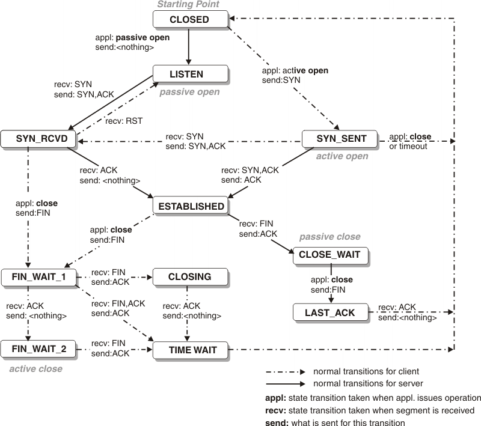
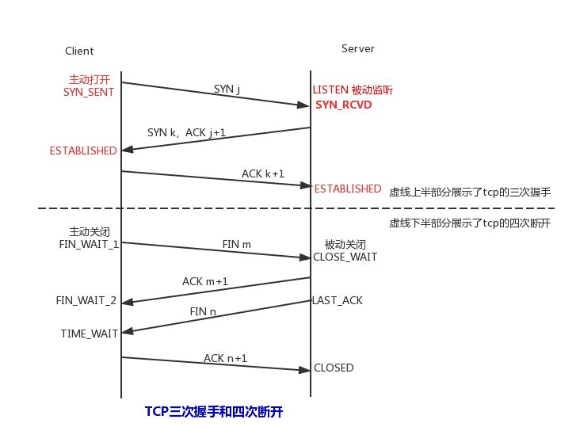

# tcp-state-examples

- [IBM, TCP connection status](https://www.ibm.com/support/knowledgecenter/SSLTBW_2.1.0/com.ibm.zos.v2r1.halu101/constatus.htm)

- [域名，端口，IP总结](https://www.jianshu.com/p/6b6b8f47a9b3)
- [Socket TCP Server一个端口可以有多少个长连接？受到什么影响？linux最大文件句柄数量总结](https://www.cnblogs.com/lemon-flm/p/8093684.html)

- [CLOSE_WAIT问题-TCP](https://www.cnblogs.com/baishuchao/p/9024205.html)
- [客户端产生CLOSE_WAIT状态的解决方案](https://blog.csdn.net/fdyufgf/article/details/83688870)
- [服务器TIME_WAIT和CLOSE_WAIT分析和解决办法](https://segmentfault.com/a/1190000014652451)

- [TCP/IP这本书讲TCP连接是如何建立和终止的？](https://segmentfault.com/a/1190000014946221)

## TCP state

1. 摘自 [IBM, TCP connection status](https://www.ibm.com/support/knowledgecenter/SSLTBW_2.1.0/com.ibm.zos.v2r1.halu101/constatus.htm)

<table cellpadding="4" cellspacing="0" summary="" class="table" width="100%" rules="all" frame="border" border="1">
    <caption>Table 1. TCP state transition description table</caption>
    <thead class="thead" align="left">
        <tr class="row">
            <th class="entry" valign="top" width="15%">TCP connection state	</th>
            <th class="entry" valign="top" width="15%">Abbreviation in MVS™ console </th>
            <th class="entry" valign="top" width="15%">Abbreviation in TSO or UNIX shell </th>
            <th class="entry" valign="top" width="55%">Description</th>
        </tr>
    </thead>
    <tbody class="tbody">
        <tr class="row">
            <td class="entry" valign="top" width="15%">LISTEN</td>
            <td class="entry" valign="top" width="15%">Listen</td>
            <td class="entry" valign="top" width="15%">Listen</td>
            <td class="entry" valign="top" width="55%">
                Waiting for a connection request from a remote TCP application.  
                This is the state in which you can find the listening socket of a local TCP server.
            </td>
        </tr>
        <tr class="row">
            <td class="entry" valign="top" width="15%">SYN-SENT</td>
            <td class="entry" valign="top" width="15%">SynSent</td>
            <td class="entry" valign="top" width="15%">SynSent</td>
            <td class="entry" valign="top" width="55%">
                Waiting for an acknowledgment from the remote endpoint after having sent a connection request. 
                Results after step 1 of the three-way TCP handshake.
            </td>
        </tr>
        <tr class="row">
            <td class="entry" valign="top" width="15%">SYN-RECEIVED</td>
            <td class="entry" valign="top" width="15%">SynRcvd</td>
            <td class="entry" valign="top" width="15%">SynRcvd</td>
            <td class="entry" valign="top" width="55%">
                This endpoint has received a connection request and sent an acknowledgment. 
                This endpoint is waiting for final acknowledgment that the other endpoint did receive 
                this endpoint's acknowledgment of the original connection request. 
                Results after step 2 of the three-way TCP handshake.
            </td>
        </tr>
        <tr class="row">
            <td class="entry" valign="top" width="15%">ESTABLISHED</td>
            <td class="entry" valign="top" width="15%">Estblsh</td>
            <td class="entry" valign="top" width="15%">Establsh</td>
            <td class="entry" valign="top" width="55%">
                Represents a fully established connection; 
                this is the normal state for the data transfer phase of the connection. 
            </td>
        </tr>
        <tr class="row">
            <td class="entry" valign="top" width="15%">FIN-WAIT-1</td>
            <td class="entry" valign="top" width="15%">FinWt1</td>
            <td class="entry" valign="top" width="15%">FinWait1</td>
            <td class="entry" valign="top" width="55%">
                Waiting for an acknowledgment of the connection
                termination request or for a simultaneous connection termination request
                from the remote TCP.  
                This state is normally of short duration. 
            </td>
        </tr>
        <tr class="row">
            <td class="entry" valign="top" width="15%">FIN-WAIT-2</td>
            <td class="entry" valign="top" width="15%">FinWt2</td>
            <td class="entry" valign="top" width="15%">FinWait2</td>
            <td class="entry" valign="top" width="55%">
                Waiting for a connection termination request
                from the remote TCP after this endpoint has sent its connection termination
                request.  This state is normally of short duration, but if the remote
                socket endpoint does not close its socket shortly after it has received
                information that this socket endpoint closed the connection, then
                it might last for some time.  Excessive FIN-WAIT-2 states can indicate
                an error in the coding of the remote application.
            </td>
        </tr>
        <tr class="row">
            <td class="entry" valign="top" width="15%">CLOSE-WAIT</td>
            <td class="entry" valign="top" width="15%">ClosWt</td>
            <td class="entry" valign="top" width="15%">ClosWait</td>
            <td class="entry" valign="top" width="55%">
                This endpoint has received a close request from
                the remote endpoint and this TCP is now waiting for a connection termination
                request from the local application. 
            </td>
        </tr>
        <tr class="row">
            <td class="entry" valign="top" width="15%">CLOSING</td>
            <td class="entry" valign="top" width="15%">Closing</td>
            <td class="entry" valign="top" width="15%">Closing</td>
            <td class="entry" valign="top" width="55%">
                Waiting for a connection termination request
                acknowledgment from the remote TCP. This state is entered when this
                endpoint receives a close request from the local application, sends
                a termination request to the remote endpoint, and receives a termination
                request before it receives the acknowledgment from the remote endpoint.
            </td>
        </tr>
        <tr class="row">
            <td class="entry" valign="top" width="15%">LAST-ACK</td>
            <td class="entry" valign="top" width="15%">LastAck</td>
            <td class="entry" valign="top" width="15%">LastAck</td>
            <td class="entry" valign="top" width="55%">
                Waiting for an acknowledgment of the connection
                termination request previously sent to the remote TCP. This state
                is entered when this endpoint received a termination request before
                it sent its termination request.
            </td>
        </tr>
        <tr class="row">
            <td class="entry" valign="top" width="15%">TIME-WAIT</td>
            <td class="entry" valign="top" width="15%">TimeWt</td>
            <td class="entry" valign="top" width="15%">TimeWait</td>
            <td class="entry" valign="top" width="55%">
                Waiting for enough time to pass to be sure the
                remote TCP received the acknowledgment of its connection termination request.
            </td>
        </tr>
        <tr class="row">
            <td class="entry" valign="top" width="15%">CLOSED</td>
            <td class="entry" valign="top" width="15%">Closed</td>
            <td class="entry" valign="top" width="15%">Closed</td>
            <td class="entry" valign="top" width="55%">Represents no connection state at all.</td>
        </tr>
    </tbody>
</table>

2. 摘自 [服务器TIME_WAIT和CLOSE_WAIT分析和解决办法](https://segmentfault.com/a/1190000014652451)
备注：
1. 如果由**接口提供者**发起close，则接口调用者属于被动close，此时**接口调用者才是下图中的 server**。
2. 主动关闭连接的一方需要等待2MSL，才会由`time_wait -> closed`

  

## CLOSE_WAIT
